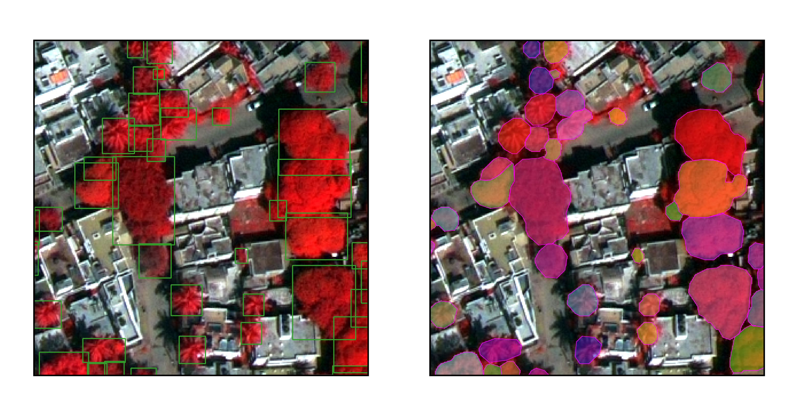

# Detection Transformer-Based Approach for Mapping Trees Outside Forests on High Resolution Satellite Imagery

*Tree crown annotations using bounding boxes and polygons.*
## Installation
```
conda env create -f environment.yml
```
The `environment.yml` file includes all packages info used for this package. 

## Config file
Check the config file in the config folder and customize the file based on your dataset path, model structure, train pipeline.
For more details, please refer to https://mmdetection.readthedocs.io/en/dev-3.x/user_guides/config.html. We put some config file in the folder `configs` for your reference.


## Training

```
python train.py config file --work-dir logs/
```

## Mapping 
Applying a trained detection model using the `pre_large_bbox.py`, by partitioning large images into several tiles (chunks), and then apply model on chunks for prediction.
Changing the image path you want to predict before using this script.
```
python pre_large_bbox.py --dir folder --cfg xx_config.py --checkpoint xx_epoch.pth 
```
Other Parameters
- `--chunk_size` chunk size for tile processing
- `--stride` stride to create overlapping image patches for inference
- `--overlap` stride to create overlapping image tiles for inference
- `--batch_size` batch size for model prediction

## Datasets
We convert Images and vectors (Annotation data) into coco Format file. For more details, please refer to our another github https://github.com/Taoorwell/dop.
Make sure the image path is right for coco dataset file. 
```
{

"images": [ { "id": 1, "width": 320, "height": 320, "file_name": "Dataset/Images\xxxxxxxx.tif" }, {}, {}, ],

"annotations": [ { "id": 1, "image_id": 2, "category_id": 1, "bbox": [ 161, 54, 28, 32 ], "area": 896, "iscrowd": 0 }, {}, {},],

"categories": [ { "id": 1, "name": "Tree", "supercategory": "none" } ]

}

```

## Tools
* Python 3.8+
* [PyTorch](https://pytorch.org/)
* [mmdetection](https://github.com/open-mmlab/mmdetection)


## Citation
```
@article{jiang2025detection,
  title={Detection transformer-based approach for mapping trees outside forests on high resolution satellite imagery},
  author={Jiang, Tao and Freudenberg, Maximilian and Kleinn, Christoph and L{\"u}ddecke, Timo and Ecker, Alexander and N{\"o}lke, Nils},
  journal={Ecological Informatics},
  pages={103114},
  year={2025},
  publisher={Elsevier}
}
```
